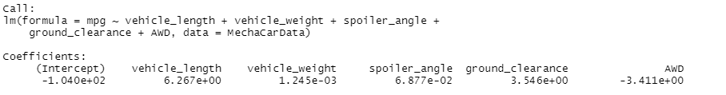
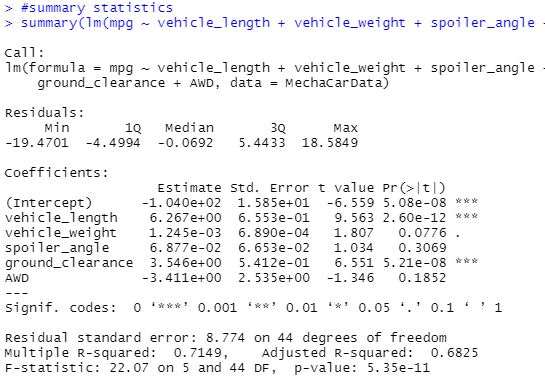

# MechaCar_Statistical_Analysis

# Deliverable 1

### Figure 1

Vehicle Length and groud clearance were the variables that provided a non-random amount of variance to the mpg values in the dataset

### Figure 2

The Slope is not zero. The p-value of 5.35 e-11 is less than 0.05.

A .71 R Squared suggests that 71% of variance can be explained by the model and only 29% of variance cannot be explained by the model.
