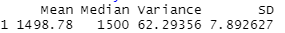
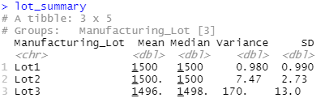

# MechaCar_Statistical_Analysis

# Deliverable 1

### Figure 1

Vehicle Length and groud clearance were the variables that provided a non-random amount of variance to the mpg values in the dataset

### Figure 2

The Slope is not zero. The p-value of 5.35 e-11 is less than 0.05.

A .71 R Squared suggests that 71% of variance can be explained by the model and only 29% of variance cannot be explained by the model.

# Deliverable 2

Question: The design specifications for the MechaCar suspension coils dictate that the variance of the suspension coils must not exceed 100 pounds per square inch. Does the current manufacturing data meet this design specification for all manufacturing lots in total and each lot individually? Why or why not?

Answer: See figures 3 and 4 below. The current manufacturing data does meet the criteria for all the lots in total as the variance is 62.29. Lots 1 and 2 meet the specifications with variances of 0.98 and 7.47. Lot 3 has a variance of 170 which exceeds the maximum of 100 pounds per square inch.

### Figure 3 Total_summary

### Figure 4 Lot_summary

